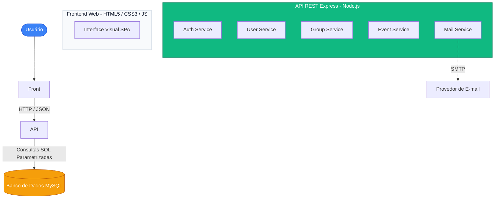
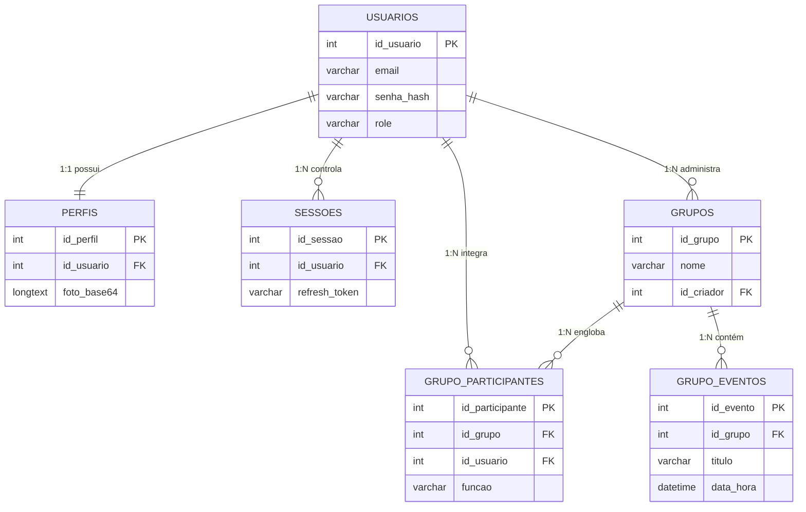
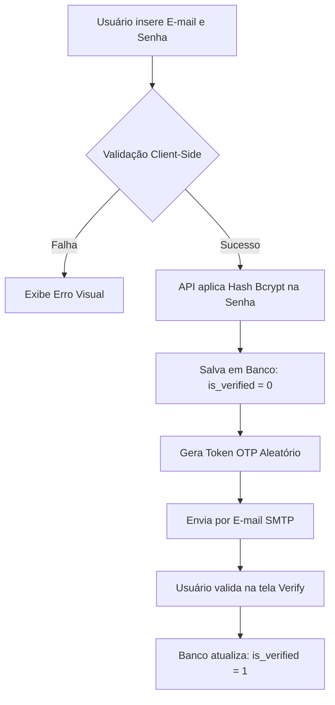
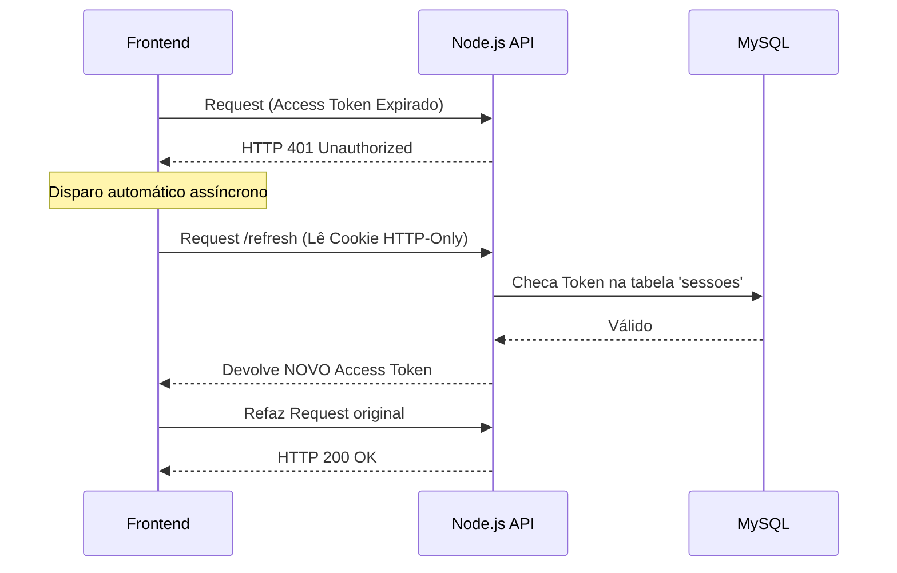
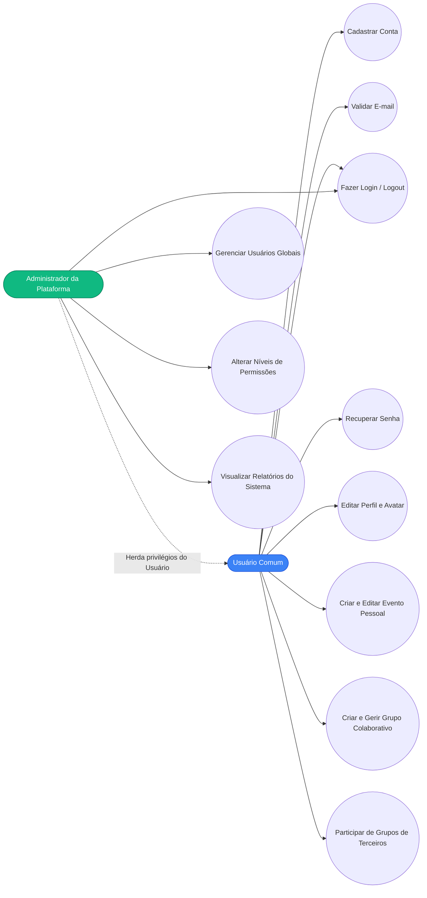

**FACULDADES INTEGRADAS DO VALE DO IVAÍ – UNIVALE**

Curso de Análise e Desenvolvimento de Sistemas

    

**Acadêmico:** PEDROSO, Jean Carlo Caleffi. F. 
**Professor Orientador:** SILVA, Owayran Torquato F.

    

# DESENVOLVIMENTO DE UM SISTEMA WEB DE GESTÃO DE AGENDA E COMPROMISSOS COM GERENCIAMENTO COLABORATIVO, NOTIFICAÇÕES AUTOMATIZADAS E ARQUITETURA SEGURA

      

**Ivaiporã – PR** 
**2026**

## 2 RESUMO

O presente trabalho descreve o desenvolvimento de uma aplicação web responsiva voltada à gestão de agendas e compromissos, integrando recursos de gerenciamento colaborativo, notificações automatizadas e mecanismos avançados de segurança. A pesquisa parte do problema da fragmentação da informação na organização pessoal e corporativa, que frequentemente resulta em perda de prazos e queda de produtividade. O objetivo principal consistiu na concepção e implementação de um sistema capaz de centralizar calendários individuais e de grupos, buscando assegurar a integridade e confidencialidade dos dados dos usuários. Metodologicamente, adotou-se o modelo de ciclo de vida iterativo e incremental, contemplando as fases de levantamento de requisitos, modelagem de dados, implementação e testes funcionais. Tecnologicamente, a aplicação foi construída sob a arquitetura cliente-servidor (API REST), empregando HTML5, CSS3 (com a vertente de design *Glassmorphism*) e JavaScript no front-end, integrados a um back-end desenvolvido em Node.js com o *framework* Express. A persistência de dados foi garantida por um banco de dados relacional MySQL. Para mitigação de riscos de segurança, implementaram-se funções de derivação de chave baseadas no algoritmo Bcrypt para armazenamento seguro de senhas, validações contra injeções de código estruturado (*SQL Injection*) e um mecanismo de autenticação baseado em *JSON Web Tokens* (JWT) adotando o modelo *Dual-Token* (Access e Refresh Tokens). Os resultados obtidos nos testes funcionais demonstraram a operabilidade do sistema, a confiabilidade do envio de notificações por e-mail e a eficácia das restrições de controle de acesso. Conclui-se que o sistema desenvolvido atende aos requisitos estabelecidos, oferecendo uma solução tecnológica viável e segura para o auxílio na gestão do tempo.

**Palavras-chave:** Engenharia de software. Segurança da informação. Autenticação JWT. Aplicações web. Gestão do tempo.

## 3 ABSTRACT

This paper describes the development of a responsive web application dedicated to schedule and appointment management, integrating collaborative management features, automated notifications, and advanced security mechanisms. The research stems from the problem of information fragmentation in personal and corporate organization, which frequently leads to missed deadlines and decreased productivity. The main objective was the conception and implementation of a system capable of centralizing individual and group calendars while seeking to ensure the integrity and confidentiality of user data. Methodologically, an iterative and incremental life cycle model was adopted, encompassing the phases of requirements elicitation, data modeling, implementation, and functional testing. Technologically, the application was built under a client-server architecture (REST API), employing HTML5, CSS3 (featuring the Glassmorphism design trend), and JavaScript on the front-end, integrated with a Node.js back-end using the Express framework. Data persistence was ensured by a MySQL relational database. To mitigate security risks, key derivation functions based on the Bcrypt algorithm were implemented for secure password storage, validations against structured code injections (SQL Injection), and an authentication mechanism based on JSON Web Tokens (JWT) adopting the Dual-Token model (Access and Refresh Tokens). The results obtained from functional tests demonstrated the system's operability, the reliability of automated email notification delivery, and the effectiveness of access control restrictions. It is concluded that the developed system meets the established requirements, offering a viable and secure technological solution to assist in time management.

**Keywords:** Software engineering. Information security. JWT authentication. Web applications. Time management.

## 4 INTRODUÇÃO

A evolução contínua das Tecnologias da Informação e Comunicação (TICs) tem reconfigurado profundamente a dinâmica das relações sociais e operacionais contemporâneas. A gestão eficiente do tempo consolidou-se como um fator estrutural para indivíduos e organizações (LAUDON; LAUDON, 2014). Em contrapartida, o volume crescente de tarefas e responsabilidades frequentemente excede a capacidade de retenção humana, resultando em sobrecarga cognitiva. Conforme aponta Drucker (2001), o tempo é o recurso mais escasso e irreversível do trabalhador do conhecimento, e sua má administração compromete todos os demais processos produtivos.

A ausência de métodos organizacionais sistemáticos e o uso de ferramentas dispersas resultam na descentralização das informações. Indivíduos e equipes de trabalho frequentemente dividem seus compromissos entre anotações físicas e aplicativos não padronizados, gerando perda de prazos e falhas de comunicação intra-equipe que afetam a produtividade global (COVEY, 2004). 

Nesse contexto, os sistemas web assumem relevância por permitir a centralização e o acesso a dados corporativos e pessoais através de arquiteturas em nuvem. Contudo, o desenvolvimento de plataformas colaborativas impõe desafios inerentes à arquitetura de software. O armazenamento centralizado de dados requer que a Engenharia de Software incorpore princípios de Segurança da Informação e privacidade de dados desde o planejamento do projeto (OWASP, 2021). Adicionalmente, a interface com o usuário deve ser intuitiva, pois sistemas de difícil operação tendem a ser abandonados, conforme postulam as heurísticas de usabilidade (NIELSEN, 1993).

Portanto, um sistema web destinado ao armazenamento de agendas deve aplicar métodos que visem garantir a autenticidade das comunicações, a verificação de identidades e a proteção dos dados contra acessos não autorizados (SOMMERVILLE, 2019). É a partir da intersecção entre a necessidade de organização sistêmica e as práticas de segurança computacional que o presente trabalho é fundamentado.

## 5 PROBLEMA DE PESQUISA

Considerando o cenário no qual a fragmentação de ferramentas de organização gera ineficiência e a centralização em nuvem impõe a adoção de padrões de segurança da informação, a pesquisa orienta-se pela seguinte questão norteadora:

**De que maneira o desenvolvimento de uma plataforma web colaborativa, baseada em arquitetura de API REST e submetida a protocolos de mitigação de vulnerabilidades (como autenticação JWT e derivação de chaves criptográficas), pode auxiliar na gestão de compromissos e reduzir falhas organizacionais por meio de notificações automatizadas?**

## 6 OBJETIVOS

### 6.1 Objetivo Geral
Desenvolver uma plataforma web responsiva destinada à gestão de agendas e compromissos colaborativos, provendo um ambiente para a criação de grupos, controle de permissões de usuários e emissão de lembretes por e-mail, suportada por mecanismos avançados de segurança e autenticação.

### 6.2 Objetivos Específicos
* Levantar e especificar os requisitos funcionais e não-funcionais do sistema;
* Elaborar a modelagem de dados relacional e diagramas UML para estruturação das regras de negócio;
* Desenvolver a interface de usuário (*Front-end*) aplicando heurísticas de responsividade e usabilidade (UX);
* Implementar o *Back-end* através de uma API REST utilizando Node.js e Express;
* Implementar mecanismos de segurança como autenticação JWT (*Access* e *Refresh Tokens*), funções de derivação de chave para senhas (Bcrypt) e prevenção contra injeção de comandos estruturados;
* Integrar a infraestrutura para o envio automatizado de notificações por e-mail (verificação de contas e lembretes de eventos);
* Realizar testes funcionais para avaliar o atendimento aos requisitos propostos e o comportamento da aplicação sob condições normais de uso.

## 7 FUNDAMENTAÇÃO TEÓRICA

### 7.1 Gestão de Tempo e Produtividade
A administração do tempo não reside em executar mais atividades simultaneamente, mas na priorização estruturada. Covey (2004) destaca a importância de categorizar tarefas entre o que é "urgente" e o que é "importante", transferindo a responsabilidade da memória de curto prazo para sistemas organizacionais. A adoção de agendas digitais modernas proporciona este alívio cognitivo. Marques e Pires (2021) corroboram que a utilização de métodos informatizados e alertas antecipados correlaciona-se com a elevação do desempenho e com a redução da ansiedade frente aos prazos estipulados.

### 7.2 Sistemas Web e Arquitetura Cliente-Servidor
Segundo Miletto e Bertagnolli (2014), a maturação de tecnologias *front-end* permitiu o desenvolvimento das *Single Page Applications* (SPA). A arquitetura cliente-servidor promove um desacoplamento vantajoso: o *front-end* (Navegador) assume a renderização e interface do usuário, enquanto o *back-end* (Servidor) processa regras de negócio e intermedia conexões a bancos de dados. A semântica desta troca de mensagens baseia-se majoritariamente no padrão arquitetural REST (*Representational State Transfer*), que orienta o uso padronizado dos verbos do protocolo HTTP (GET, POST, PUT, DELETE) para a manipulação de recursos lógicos (FIELDING, 2000). O emprego de padrões de projeto (*Design Patterns*) auxilia na organização estrutural dessas requisições de forma escalável (GAMMA et al., 2000).

### 7.3 Engenharia de Software e UML
Pressman e Maxim (2016) definem a Engenharia de Software como a aplicação de abordagens quantificáveis na construção e manutenção de sistemas. O Levantamento de Requisitos é a pedra angular desse processo; ambiguidades não resolvidas nesta etapa refletem-se em custos exponenciais durante o desenvolvimento (SOMMERVILLE, 2019). A UML (*Unified Modeling Language*) desponta como a linguagem padrão universal para modelagem orientada a objetos e documentação de abstrações sistêmicas, como Casos de Uso e Diagramas de Componentes (BOOCH; RUMBAUGH; JACOBSON, 2005).

### 7.4 Bancos de Dados Relacionais e Propriedades ACID
A persistência da informação, garantindo que "Usuários" possuam "Grupos" e que estes grupos acomodem "Eventos", exige uma modelagem estrita. Elmasri e Navathe (2011) elucidam que os Sistemas Gerenciadores de Banco de Dados Relacionais (SGBDR) se apoiam nas propriedades transacionais ACID:
* **Atomicidade:** Garante que operações agrupadas sejam processadas em totalidade ou falhem por completo.
* **Consistência:** Assegura que o banco migre apenas entre estados válidos, respeitando constrições.
* **Isolamento:** Transações simultâneas não interferem mutuamente.
* **Durabilidade:** Dados confirmados persistem fisicamente mesmo em casos de falha de energia.

A Normalização de Dados é o processo de eliminação de redundâncias. A **Primeira Forma Normal (1FN)** assegura atributos atômicos; a **Segunda (2FN)** previne dependências parciais de chaves; e a **Terceira Forma Normal (3FN)** isola dependências transitivas, evitando a anomalia de exclusão (ELMASRI; NAVATHE, 2011).

### 7.5 Segurança da Informação e Privacidade (LGPD)
O projeto OWASP e a norma ASVS (*Application Security Verification Standard*) elencam as vulnerabilidades contemporâneas mais severas, ditando que aplicações devem seguir o **Princípio do Menor Privilégio** — concedendo aos usuários apenas os direitos estritamente necessários. A separação entre **Autenticação** (provar quem o usuário é) e **Autorização** (o que o usuário pode fazer) é um alicerce dessa disciplina.
A promulgação da Lei Geral de Proteção de Dados Pessoais (LGPD) impõe a necessidade de proteger informações sensíveis contra o acesso não autorizado.
* **Derivação de Chaves Criptográficas:** O algoritmo *Bcrypt* incorpora algoritmos de *key stretching* (alargamento de chave) com um *salt* dinâmico para calcular *hashes* de senhas irreversíveis.
* **JSON Web Token (JWT):** O RFC 7519 define o JWT para autenticação *Stateless*. Para diminuir a superfície de ataque em caso de roubo de sessão, aplica-se o conceito *Dual-Token*: *Access Tokens* de duração curta (e.g. 15 minutos) e *Refresh Tokens* de longa duração para validar silenciosamente a permanência do usuário no sistema.

### 7.6 Experiência do Usuário (UX) e Interface
A experiência do usuário dita se um sistema será adotado rotineiramente. Nielsen (1993) descreve que interfaces devem priorizar o reconhecimento em vez da memorização. A responsividade assegura fluidez operacional em variadas resoluções. O estilo *Glassmorphism* utiliza filtros de desfoque (*backdrop-filter*), opacidade controlada e sombreamentos espaciais, recursos que além do apelo estético conferem noção de profundidade às camadas de interação.

## 8 METODOLOGIA

O método adotado foi o modelo Iterativo e Incremental. Essa abordagem permite o desenvolvimento gradual das funcionalidades, favorecendo ajustes técnicos e reavaliações estruturais ao longo do ciclo de vida da aplicação.

As fases metodológicas consistiram em:
1. **Levantamento e Especificação de Requisitos:** Elicitação formal das funcionalidades esperadas do software (autenticação, agenda corporativa, permissões de usuário) organizadas em tabelas funcionais e não-funcionais.
2. **Modelagem de Sistemas:** Representação arquitetônica (Diagrama de Componentes), modelagem de dados (Diagrama Entidade-Relacionamento) e levantamento interativo de processos por meio de Diagramas UML (Casos de Uso).
3. **Desenvolvimento (Construção Lógica):** Implementação segregada, utilizando JavaScript Vanilla para a construção das lógicas de visualização no navegador e Node.js/Express para o processamento de regras na API do servidor.
4. **Implementação de Segurança e Criptografia:** Incorporação das rotinas de hashing de senhas, validações de *middleware* contra requisições malformadas, configuração de HTTP-Only Cookies e parametrização de banco de dados.
5. **Testes Funcionais e de Validação:** Execução de rotinas sistemáticas simulando operações de acesso, validações contra inserções maliciosas e medição da precisão das rotinas assíncronas de e-mails.

## 9 REQUISITOS DO SISTEMA

A delimitação técnica e funcional do projeto fundamentou-se nos Requisitos Funcionais (descrição de comportamentos do sistema) e nos Requisitos Não-Funcionais (restrições técnicas e de qualidade arquitetural). 

A Tabela 1 expõe os principais requisitos adotados.

**Tabela 1 – Requisitos Funcionais e Não-Funcionais**

| Código | Tipo | Descrição do Requisito |
| :--- | :--- | :--- |
| **RF01** | Funcional | O sistema deve permitir o cadastro de usuários e a edição/exclusão de perfil. |
| **RF02** | Funcional | O sistema deve validar contas cadastradas mediante envio de token numérico via e-mail. |
| **RF03** | Funcional | O sistema deve permitir a autenticação (login) de usuários registrados e validados. |
| **RF04** | Funcional | O sistema deve permitir que usuários criem grupos colaborativos e adicionem membros. |
| **RF05** | Funcional | O sistema deve permitir a criação, edição e exclusão de compromissos pessoais ou de grupos. |
| **RF06** | Funcional | O sistema deve suportar um painel de administração global para usuários com permissão superior. |
| **RF07** | Funcional | O sistema deve recuperar senhas esquecidas de usuários através de geração de token temporário. |
| **RNF01** | Segurança | O acesso às rotas da API deve requerer autenticação validada via JSON Web Token (JWT). |
| **RNF02** | Segurança | A persistência das senhas deve empregar funções de derivação de chave utilizando o algoritmo Bcrypt. |
| **RNF03** | Segurança | Consultas a bancos de dados devem ser parametrizadas para mitigação de vulnerabilidades (SQL Injection). |
| **RNF04** | Usabilidade | A interface web deverá apresentar design responsivo e fluidez visual baseada no conceito *Glassmorphism*. |

*Fonte: Elaborado pelo autor (2026).*

## 10 DESENVOLVIMENTO DO SISTEMA

### 10.1 Tecnologias Utilizadas
A adoção tecnológica pautou-se na estruturação em *stack* JavaScript, garantindo coesão sintática em toda a arquitetura cliente-servidor. A Tabela 2 apresenta as principais ferramentas empregadas.

**Tabela 2 – Ferramentas e Tecnologias Utilizadas**

| Tecnologia | Aplicação no Projeto |
| :--- | :--- |
| **HTML5** | Estruturação semântica das páginas e formulários web. |
| **CSS3** | Estilização, *Media Queries* (responsividade) e *Glassmorphism*. |
| **JavaScript** | Lógica de interatividade (*Client-side*) e requisições à API. |
| **Node.js** | Ambiente de execução assíncrono para o servidor (*Back-end*). |
| **Express.js** | *Framework* utilizado para o roteamento e construção da API REST. |
| **MySQL** | Sistema Gerenciador de Banco de Dados Relacional para persistência de dados. |
| **JWT** | Mecanismo de autenticação e sessão segura baseada em tokens assinados. |
| **Bcrypt** | Aplicação de *hashes* criptográficos unívocos para proteção das senhas. |
| **Nodemailer** | Módulo de automação responsável pela comunicação e envio de e-mails transacionais. |

*Fonte: Elaborado pelo autor (2026).*

### 10.2 Arquitetura e Diagrama de Componentes
O sistema "Agenda Web" emprega o modelo cliente-servidor desacoplado por intermédio de uma API REST. O Diagrama de Componentes (Figura 1) expõe as divisões físicas e lógicas da aplicação, enfatizando os serviços isolados geridos pelo Express (Auth, User, Group, Event e Mail).

**Figura 1: Diagrama de Componentes do Sistema (UML)**

*Fonte: Elaborado pelo autor (2026).*

### 10.3 Desenvolvimento Front-end e Demonstração Visual
A camada de apresentação abstém-se de frameworks pesados, favorecendo o Document Object Model (DOM) nativo em conjunto com `fetch` API. O design *Glassmorphism* atua fortemente com as tags de transparência `rgba` conjugadas à diretiva `backdrop-filter`.

Abaixo, evidenciam-se as interfaces reais concebidas:

*(Inserir Figura: Tela de Login)*  
**Figura 2: Tela Inicial de Autenticação do Sistema**  
*(A Figura 2 apresenta a tela inicial de autenticação do sistema, desenvolvida utilizando princípios de interface limpa e validação dos dados antes de seu envio seguro ao servidor).*

*(Inserir Figura: Dashboard / Calendário)*  
**Figura 3: Dashboard e Calendário Principal**  
*(A Figura 3 expõe a interface central do usuário após o login, destacando o calendário com distribuição espacial dos compromissos mensais e a barra de navegação responsiva).*

*(Inserir Figura: Gerenciamento de Grupo)*  
**Figura 4: Gerenciamento de Grupo Colaborativo**  
*(A Figura 4 ilustra o ambiente de colaboração, contendo a lista dos membros participantes, os níveis hierárquicos estabelecidos e os eventos limitados àquele grupo).*

*(Inserir Figura: Painel Administrativo)*  
**Figura 5: Painel Administrativo Global**  
*(A Figura 5 retrata a visão gerencial exclusiva de perfis Administradores, listando os usuários cadastrados e habilitando alterações permissivas via sistema de toggles).*

### 10.4 Desenvolvimento Back-end
O ambiente Node.js abriga o *back-end* utilizando Express. A estrutura modulariza-se em:
* **Routes:** Declaração dos caminhos de acesso (`/auth`, `/groups`, `/events`).
* **Middlewares:** Interceptores de rotas. O interceptor verifica se existe um token JWT no cabeçalho antes de permitir o avanço para a base de dados.
* **Controllers:** Isolam a lógica imperativa do fluxo, extraindo requisições HTTP e formatando respostas JSON com seus respectivos *Status Codes*.

### 10.5 Banco de Dados (DER)
A base MySQL normalizada previne anomalias de transação. A Tabela 3 apresenta as finalidades das entidades.

**Tabela 3 – Dicionário de Dados do Banco MySQL**

| Tabela | Finalidade e Descrição |
| :--- | :--- |
| **`usuarios`** | Estrutura central com credenciais (e-mail), *hash* da senha e flag de verificação. |
| **`perfis`** | Relacionamento 1:1 para armazenamento de avatares fotográficos formatados em Base64. |
| **`sessoes`** | Mantém registros temporários de *Refresh Tokens* e seus prazos limites de vida. |
| **`grupos`** | Entidade criadora para ambientes de colaboração inter-usuários. |
| **`grupo_participantes`** | Tabela associativa (M:N) responsável pelo mapeamento hierárquico (Dono, Membro, Admin). |
| **`grupo_eventos`** | Armazena compromissos cronológicos atrelados exclusivamente ao ID de um grupo. |

**Figura 6: Diagrama Entidade-Relacionamento (DER)**

### 10.6 Sistema de Autenticação
O cadastro de contas assegura a verificação do controle de acesso (e-mail verdadeiro). 

**Figura 7: Fluxo de Registro e Validação OTP**

### 10.7 Segurança Aplicada (Arquitetura JWT)
A técnica *Dual-Token* resolve a dependência de um token estático vulnerável. 
* O **Access Token**, de vida muito curta (15 min), viaja livremente em *Headers* (Cabeçalhos HTTP). 
* O **Refresh Token**, de duração dilatada, viaja oculto em um Cookie HTTP-Only criptografado, protegido de manipulações.

**Figura 8: Fluxo de Renovação Automática de Token**

### 10.8 Funcionamento da Aplicação e Fluxo do Usuário
A intersecção de todas as lógicas anteriormente citadas culmina no fluxo contínuo de utilização do sistema por parte do usuário final. O comportamento esperado da aplicação transcorre nas seguintes etapas lógicas:
1. O usuário submete suas informações na tela de **Cadastro**.
2. O sistema envia um **código de verificação OTP** (One Time Password) à caixa de e-mail informada.
3. O usuário insere o código na aplicação, confirmando sua **titularidade** sobre o endereço.
4. O usuário realiza o **Login** com e-mail e senha.
5. O sistema valida as credenciais no banco e gera os **Tokens JWT** (sessão iniciada silenciosamente).
6. O painel principal (*Dashboard*) é renderizado, listando calendários e eventos.
7. O usuário insere um compromisso ou convida outro usuário pelo e-mail para um **Grupo Colaborativo**.
8. O sistema registra o agendamento no banco de dados e dispara as **notificações de lembrete** de forma temporizada e autônoma.

## 11 MODELAGEM DE CASOS DE USO (UML)

Para delimitar rigidamente os fluxos de interações de usuários com as funcionalidades oferecidas pelo *software*, implementou-se o Diagrama de Casos de Uso com o mapeamento completo dos dois níveis basilares: o usuário comum e a conta administrativa.

**Figura 9: Diagrama de Casos de Uso (UML)**

*Fonte: Elaborado pelo autor (2026).*

## 12 RESULTADOS OBTIDOS

A fase empírica avaliou a resiliência estrutural e a aderência aos requisitos traçados. Durante os testes funcionais realizados em ambiente de desenvolvimento, observou-se o comportamento adequado da aplicação quanto ao processamento das requisições, roteamento da interface e execução das regras de negócio atreladas à segurança.
A integridade da validação foi averiguada exaustivamente por meio de Testes Funcionais que verificam a proteção do software perante estímulos maliciosos (Caixa Preta).

A Tabela 4 resume um extrato das avaliações realizadas para validação dos mecanismos defensivos lógicos.

**Tabela 4 – Registro de Testes Funcionais de Validação**

| Cenário de Teste Funcional | Resultado Esperado | Resultado Obtido |
| :--- | :--- | :--- |
| **Teste funcional de validação contra entradas maliciosas no Login (Ex: `' OR 1=1 --`)** | A camada de abstração do SGBD deve tratar a submissão como texto inócuo. | **Aprovado.** A conexão parametrizada isolou a entrada. O acesso ao painel foi rechaçado. |
| **Bloqueio de Sessão (Atraso induzido no Access Token)** | Após expirado, requisições devem ser freadas pelo *middleware* até a renovação. | **Aprovado.** A API exigiu e concluiu a intervenção silenciosa de renovação via Refresh Token. |
| **Forçar privilégio não autorizado via manipulação de rota URL (`/api/admin`)** | O usuário comum deve ter o fluxo imediatamente abortado ao acionar rotas gerenciais. | **Aprovado.** O validador JWT inferiu incompatibilidade no nível de permissão, negando autorização (HTTP 403). |
| **Persistência Volátil de Imagem (Formato Base64)** | Operações destrutivas na árvore física do *Back-end* não devem extinguir as fotos de perfil. | **Aprovado.** A conversão manteve-se residente no banco relacional `LONGTEXT`, imune a reinicializações efêmeras. |
| **Integridade da rotina de e-mail OTP** | O código transacional deve alcançar o e-mail em tempo inferior à sua janela de expiração. | **Aprovado.** O disparo via Nodemailer completou-se com sucesso sem travar a navegação principal (assíncrono). |

*Fonte: Elaborado pelo autor (2026).*

## 13 LIMITAÇÕES E TRABALHOS FUTUROS

Todo artefato tecnológico complexo exibe limites atrelados a sua arquitetura base. Como o sistema Agenda Web desenvolveu-se puramente por vias de interações baseadas em requisições de clientes (*HTTP Polling*), constata-se a limitação temporária do software em emitir alertas nativos no dispositivo do usuário, necessitando amparo do provedor de e-mail como *proxy* de notificações.

Sugere-se as seguintes rotas de pesquisa e desenvolvimento em trabalhos futuros:
* **Aplicativo Mobile Nativo:** Utilizar a API REST existente para fornecer dados a um aplicativo (React Native, Flutter), habilitando envio direto de *Notificações Push*.
* **Sincronização em Tempo Real:** Adequação para suporte a bibliotecas de WebSockets (ex: Socket.io), que permitirão a repintura instantânea das interfaces de todos os participantes de um grupo assim que um compromisso for editado ou adicionado.
* **Integração a Provedores Institucionais:** Criação de mecanismos bidirecionais de importação e sincronização cruzada oficial com a API do Google Calendar.

## 14 CONCLUSÃO

O presente estudo consolidou o desenvolvimento empírico de um ambiente web voltado à orquestração de compromissos individuais e grupais. Os resultados indicam que a aplicação satisfaz aos requisitos estabelecidos no planejamento do projeto, demonstrando a funcionalidade da divisão arquitetural proposta e a integridade do controle de sessões.

A revisão sistemática da literatura evidenciou que a migração de anotações para ambientes computacionais distribuídos invoca responsabilidades fundamentais sobre privacidade. A arquitetura adotada reflete a assimilação dessa teoria ao pautar-se nas normas de normalização (até 3FN) do banco de dados relacional (MySQL) e na imposição do princípio de menor privilégio na alocação colaborativa. 

Sob o rigor da Engenharia de Software, as soluções empregadas contribuíram ativamente para reduzir riscos associados a vulnerabilidades conhecidas em aplicações web (OWASP). A implementação da rotina *Dual-Token JSON Web Token*, o uso de *cookies HttpOnly* e a aplicação consistente da função de derivação de chave (Bcrypt) conferiram estabilidade defensiva aos dados dos usuários.

Conclui-se, destarte, que o artefato materializado caracteriza-se como uma aplicação prática, robusta e escalável dos conceitos estudados durante o curso. A plataforma atende aos desafios de governança, usabilidade e segurança da informação requeridos por aplicações web modernas, constituindo-se em uma base sólida que habilita contínuos aprimoramentos para o ecossistema tecnológico.

## 15 REFERÊNCIAS

ASSOCIAÇÃO BRASILEIRA DE NORMAS TÉCNICAS. **NBR 6022**: Informação e documentação: artigo em publicação periódica técnica e/ou científica: apresentação. Rio de Janeiro, 2018.

BOOCH, Grady; RUMBAUGH, James; JACOBSON, Ivar. **UML: Guia do Usuário**. 2. ed. Rio de Janeiro: Elsevier, 2005.

BRASIL. **Lei n° 13.709, de 14 de agosto de 2018**. Lei Geral de Proteção de Dados Pessoais (LGPD). Brasília, DF: Presidência da República, 2018.

COVEY, Stephen R. **Os 7 hábitos das pessoas altamente eficazes**. Rio de Janeiro: BestSeller, 2004.

DRUCKER, Peter F. **O gestor eficaz**. Lisboa: GestãoPlus, 2001.

ELMASRI, Ramez; NAVATHE, Shamkant B. **Sistemas de Banco de Dados**. 6. ed. São Paulo: Pearson Addison Wesley, 2011.

FIELDING, Roy T. **Architectural Styles and the Design of Network-based Software Architectures**. Tese (Doutorado) – University of California, Irvine, 2000.

GAMMA, Erich et al. **Padrões de Projeto: Soluções Reutilizáveis de Software Orientado a Objetos**. Porto Alegre: Bookman, 2000.

GUERREIRO, Reinaldo; SOUTES, Dione Olesczuk. Práticas de gestão baseada no tempo: um estudo em empresas no Brasil. **Revista Contabilidade & Finanças**, v. 24, n. 63, p. 181-194, 2013.

HTTP SEMANTICS. **RFC 9110: HTTP Semantics**. Internet Engineering Task Force (IETF), junho 2022. Disponível em: https://datatracker.ietf.org/doc/html/rfc9110. Acesso em: 22 jun. 2026.

ISO/IEC. **ISO/IEC 27001:2022**: Information security, cybersecurity and privacy protection — Information security management systems — Requirements. Genebra: ISO, 2022.

JONES, Michael; BRADLEY, John; SAKIMURA, Nat. **RFC 7519: JSON Web Token (JWT)**. Internet Engineering Task Force (IETF), maio 2015. Disponível em: https://datatracker.ietf.org/doc/html/rfc7519. Acesso em: 22 jun. 2026.

LAUDON, Kenneth C.; LAUDON, Jane P. **Sistemas de Informação Gerenciais**. 11. ed. São Paulo: Pearson, 2014.

MARQUES, Bruna Guimarães; PIRES, Emmy Uehara. Gerenciamento de tempo em adultos: método, técnicas e aplicações. **Psico**, v. 52, n. 1, p. e35857, 2021. 

MILETTO, Evandro Manara; BERTAGNOLLI, Silvia de Castro. **Desenvolvimento de Software II: introdução ao desenvolvimento web com HTML, CSS, JavaScript e PHP**. Porto Alegre: Bookman, 2014.

MYSQL. **MySQL 8.0 Reference Manual**. Oracle Corporation, 2026. Disponível em: https://dev.mysql.com/doc/refman/8.0/en/. Acesso em: 22 jun. 2026.

NIELSEN, Jakob. **Usability Engineering**. San Francisco: Morgan Kaufmann, 1993.

NODE.JS. **Node.js Documentation**. OpenJS Foundation, 2026. Disponível em: https://nodejs.org/docs/. Acesso em: 22 jun. 2026.

OWASP. **OWASP Application Security Verification Standard (ASVS)**. Version 4.0.3. Open Worldwide Application Security Project, 2021. Disponível em: https://owasp.org/www-project-application-security-verification-standard/. Acesso em: 22 jun. 2026.

PRESSMAN, Roger S.; MAXIM, Bruce R. **Engenharia de Software: uma abordagem profissional**. 8. ed. Porto Alegre: AMGH, 2016.

SOMMERVILLE, Ian. **Engenharia de Software**. 10. ed. São Paulo: Pearson Education do Brasil, 2019.
