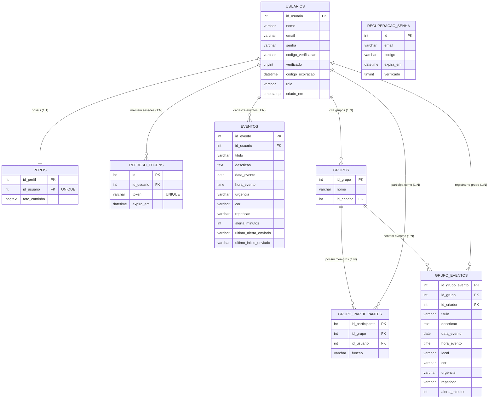

# Modelo de Entidade-Relacionamento (DER) - Agenda Web

Este documento descreve a modelagem completa de Banco de Dados Relacional do sistema **Agenda Web**, baseada diretamente no esquema de criação do arquivo `db.js`.

O banco de dados contempla o gerenciamento de usuários, segurança (tokens), agendas pessoais e módulos colaborativos (grupos).

---

## 1. Diagrama Visual (Mermaid)

*Dica: Se você estiver usando o Visual Studio Code, pressione `Ctrl + Shift + V` para renderizar o diagrama abaixo como uma imagem estruturada.*

---

## 2. Dicionário de Dados

Abaixo estão detalhadas todas as tabelas criadas pela API do sistema. Todas as exclusões são controladas via restrição referencial `ON DELETE CASCADE`, garantindo que não existam dados "órfãos" no banco.

### 2.1. Núcleo de Usuários e Segurança
* **`usuarios`**: Tabela mestre. Armazena as credenciais primárias, *hashes* de senha (Bcrypt), e controla as verificações de e-mail (OTP) e privilégios de sistema (`role` = 'user' ou 'admin').
* **`perfis`**: Relação exclusiva `1:1` com `usuarios`. Armazena a coluna `foto_caminho` (como `LONGTEXT`) para salvar as imagens de avatar em formato *Base64* direto no banco.
* **`refresh_tokens`**: Gerencia a segurança em segundo plano (Arquitetura *Dual-Token*). Armazena o token invisível que renova a sessão do usuário a cada 15 minutos sem precisar refazer login.
* **`recuperacao_senha`**: Tabela temporária para gerenciar solicitações de redefinição de senhas com limites estritos de expiração (`expira_em`).
* **`msal_cache`**: *(Tabela auxiliar)* Mantém o cache persistente da integração com o Azure Active Directory / Microsoft Graph (para os envios de e-mail).

### 2.2. Módulo de Agenda Pessoal
* **`eventos`**: Representa a agenda individual do usuário. Contém metadados do compromisso, regras de repetição, urgência, cores hexadecimais para o front-end e um sistema de travas (`ultimo_alerta_enviado`) para que o agendador automático (Cron) não dispare o mesmo e-mail de notificação duas vezes.

### 2.3. Módulo de Grupos (Colaborativo)
* **`grupos`**: Entidade lógica que representa um agrupamento de pessoas (ex: "Equipe TI", "Família"). Armazena apenas o nome do grupo e o ID do usuário que fundou (`id_criador`).
* **`grupo_participantes`**: Tabela associativa (M:N). Ela interliga um Usuário a um Grupo e define qual é o cargo dele lá dentro (`funcao`: *dono*, *admin* ou *membro*).
* **`grupo_eventos`**: Espelha o funcionamento da agenda pessoal, mas o evento pertence estritamente ao Grupo e não apenas a uma pessoa. Possui chave estrangeira extra identificando quem foi o usuário específico do grupo que criou aquele agendamento (`id_criador`).

